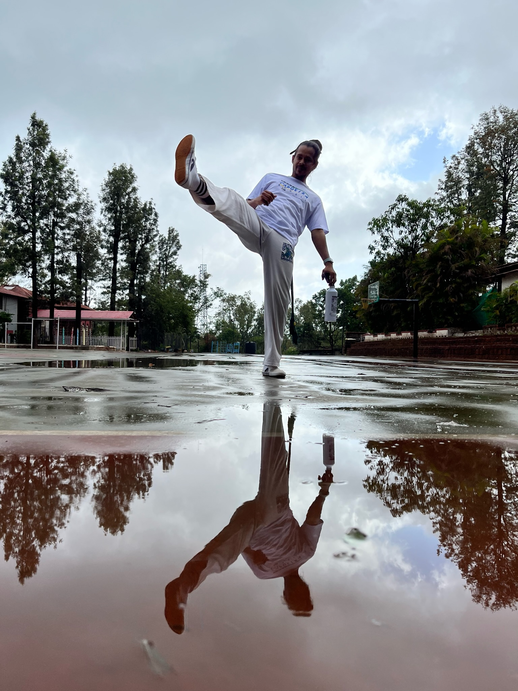

<!DOCTYPE html>
<html lang="en">
<head>
  <meta charset="UTF-8" />
  <meta name="viewport" content="width=device-width, initial-scale=1" />
  <title>Capoeira in Pune | Grupo Capoeira Brasil Pune</title>
  <meta name="description" content="Movement, music, and community — Capoeira in Pune for men, women, and children. Classes in Kalyani Nagar and Aundh. Paid trial reimbursed into your first month. Message on WhatsApp to join." />
  <link rel="preconnect" href="[fonts.googleapis.com](https://fonts.googleapis.com)" />
  <link rel="preconnect" href="[fonts.gstatic.com](https://fonts.gstatic.com)" crossorigin />
  <link href="[fonts.googleapis.com](https://fonts.googleapis.com/css2?family=Inter:wght@400;600;700&display=swap)" rel="stylesheet" />
  <link rel="stylesheet" href="style.css" />
  <link rel="icon" href="favicon.ico" />
</head>

<body>
  <header class="nav">
    

      <a href="#home" class="brand">
        
        Grupo Capoeira Brasil Pune
      </a>
      <nav class="nav-links">
        <a href="#classes">Classes</a>
        <a href="#schedule">Schedule</a>
        <a href="#fees">Fees</a>
        <a href="#about">About</a>
        <a href="#faqs">FAQs</a>
        <a href="#contact">Contact</a>
        <a class="btn btn-primary btn-sm hide-mobile" href="[wa.me](https://wa.me/919766481796?text=Hi%20Capoeira%20Pune!%20I%27d%20like%20to%20book%20a%20trial.%20I%27m%20interested%20in%20%5BAdults%7CKids%5D%20at%20%5BArtsphere%7CAundh%5D)" target="_blank" rel="noopener">WhatsApp</a>
      </nav>
    

  </header>

  <main>
    <!-- Hero -->
    <section id="home" class="section hero">
      

        

          <h1>Movement, music, and community — Capoeira in Pune</h1>
          

            Classes for adults and kids at Kalyani Nagar and Aundh.
            Paid trial that rolls into your first month.
          

          

            <a class="btn btn-primary" href="[wa.me](https://wa.me/919766481796?text=Hi%20Capoeira%20Pune!%20I%27d%20like%20to%20book%20a%20trial)" target="_blank" rel="noopener">
              Message on WhatsApp
            </a>
            <a class="btn btn-outline" href="#classes">Explore Classes</a>
          

          
Grupo Capoeira Brasil • Under Mestre Caxias • Led by Instrutor Arrepiado

        

        

          
        

      

    </section>

    <!-- Programs -->
    <section id="classes" class="section">
      

        <h2 class="section-title">Classes for everyone</h2>
        
Capoeira is for men, women, and children — beginners welcome.

        

          <article class="card">
            <h3>Adults</h3>
            <ul>
              <li>Strength, mobility, and flow</li>
              <li>Kicks, dodges, acrobatics, and music</li>
              <li>Rolling starts — join any week</li>
            </ul>
            <a class="btn btn-primary" href="[wa.me](https://wa.me/919766481796?text=Hi%20Capoeira%20Pune!%20I%27m%20interested%20in%20Adult%20classes)">WhatsApp to join</a>
          </article>

          <article class="card">
            <h3>Kids & Teens (3–6, 7+)</h3>
            <ul>
              <li>Coordination, focus, and confidence</li>
              <li>Play, rhythm, and teamwork</li>
              <li>Start from age 3</li>
            </ul>
            <a class="btn btn-primary" href="[wa.me](https://wa.me/919766481796?text=Hi%20Capoeira%20Pune!%20I%27d%20like%20a%20trial%20for%20Kids%20classes)">Book a trial on WhatsApp</a>
          </article>

          <article class="card">
            <h3>Toddlers (3–6)</h3>
            <ul>
              <li>Short, playful sessions</li>
              <li>Balance, control, and rhythm</li>
              <li>Parent‑friendly environment</li>
            </ul>
            <a class="btn btn-primary" href="[wa.me](https://wa.me/919766481796?text=Hi%20Capoeira%20Pune!%20I%20want%20details%20for%20Toddlers%20sessions)">Enquire on WhatsApp</a>
          </article>

          <article class="card">
            <h3>Private • Workshops • Retreats</h3>
            <ul>
              <li>1:1, small groups, schools, corporates</li>
              <li>Custom 60–90 minute formats</li>
              <li>Travel retreats and showcases</li>
            </ul>
            <a class="btn btn-primary" href="[wa.me](https://wa.me/919766481796?text=Hi%20Capoeira%20Pune!%20I%20want%20to%20plan%20a%20workshop%2Fretreat)">WhatsApp for dates</a>
          </article>
        

      

    </section>

    <!-- Schedule & Locations -->
    <section id="schedule" class="section alt">
      

        <h2 class="section-title">Schedule & Locations</h2>

        

          

            <h3>Artsphere, Kalyani Nagar</h3>
            
[Insert full street address here], Kalyani Nagar, Pune

            <ul class="list">
              <li><strong>Adults — Wed & Fri</strong>: 8:00–9:15 am • 8:00–9:15 pm</li>
              <li><strong>Kids — Sat & Sun</strong>: 9:00–9:45 am (3–6) • 9:45–11:15 am (7+)</li>
            </ul>
            <a class="link" target="_blank" rel="noopener" href="[Insert Google Maps URL here]">Open in Google Maps</a>
          

          

            <h3>The Open Door, Aundh</h3>
            
[Insert full street address here], Aundh, Pune

            
Select batches and workshops — message for current dates.

            <a class="link" target="_blank" rel="noopener" href="[Insert Google Maps URL here]">Open in Google Maps</a>
          

        

        

          <a class="btn btn-primary" href="[wa.me](https://wa.me/919766481796?text=Hi%20Capoeira%20Pune!%20Please%20confirm%20today%E2%80%99s%20schedule)">Confirm today’s schedule on WhatsApp</a>
        

      

    </section>

    <!-- Why us -->
    <section class="section">
      

        

          <h2 class="section-title">Why Capoeira with us</h2>
          <ul class="list">
            <li><strong>Community‑first:</strong> train with ages 3 to 60+ in a friendly circle.</li>
            <li><strong>Balanced practice:</strong> martial art, music, acrobatics, and culture in one.</li>
            <li><strong>Proven lineage:</strong> Grupo Capoeira Brasil under Mestre Caxias.</li>
          </ul>
        

        

          <h2 class="section-title">Trial & Fees</h2>
          
<strong>Paid Trial:</strong> your trial fee is credited to your first month when you join.

          
<strong>Fees vary</strong> by class and venue. Message for the best plan for your goals and schedule.

          <a class="btn btn-primary" href="[wa.me](https://wa.me/919766481796?text=Hi%20Capoeira%20Pune!%20Could%20you%20share%20fees%20and%20trial%20details%3F)">WhatsApp for fees</a>
        

      

    </section>

    <!-- About -->
    <section id="about" class="section alt">
      

        <h2 class="section-title">About us</h2>
        

          

            

              Grupo Capoeira Brasil Pune brings the rich tradition of Brazilian Capoeira to India —
              blending movement, rhythm, and community. We’re part of <strong>Grupo Capoeira Brasil</strong>,
              under <strong>Mestre Caxias</strong>.
            

            

              <strong>Instrutor Arrepiado (Sagar Jain)</strong> has trained for 14+ years and teaches students from
              age 3 to 60+. His classes rest on three values: <em>consistency</em>, <em>respect</em>, and <em>energy</em>.
              With him, you don’t just learn to kick or dodge — you learn rhythm, patience, and self‑expression.
            

          

          

            
          

        

      

    </section>

    <!-- FAQs -->
    <section id="faqs" class="section">
      

        <h2 class="section-title">FAQs</h2>
        <dl class="faq">
          <dt>Is Capoeira safe for beginners?</dt>
          <dd>Yes. We teach safe basics first, progress gradually, and adapt to your level.</dd>

          <dt>Do I need to be flexible or fit?</dt>
          <dd>No. You’ll build flexibility and fitness through training. Start where you are.</dd>

          <dt>What should I bring?</dt>
          <dd>Water, a small towel, comfortable sportswear. We usually train barefoot.</dd>

          <dt>Is Capoeira a fight or a dance?</dt>
          <dd>It’s a Brazilian martial art with music and flow. You’ll learn strategy, rhythm, and control.</dd>

          <dt>How do trials work?</dt>
          <dd>Your trial is paid; if you join, that fee is credited to your first month.</dd>

          <dt>What are the age groups for kids?</dt>
          <dd>3–6 years (45 minutes) and 7+ years (90 minutes).</dd>

          <dt>When can I start?</dt>
          <dd>Rolling batches — start any week. Message us to pick your first class.</dd>
        </dl>
      

    </section>

    <!-- Gallery -->
    <section id="gallery" class="section alt">
      

        <h2 class="section-title">Gallery</h2>
        

          
          
          
          
          
          
        

      

    </section>

    <!-- Contact -->
    <section id="contact" class="section">
      

        <h2 class="section-title">Contact</h2>
        

          
<strong>Grupo Capoeira Brasil Pune</strong>

          
Pune, India

          
Email: <a href="mailto:arrepiado@capoeirapune.com">arrepiado@capoeirapune.com</a>

          
Phone/WhatsApp: <a href="[wa.me](https://wa.me/919766481796)" target="_blank" rel="noopener">+91 97664 81796</a>

          
Instagram: <a href="[instagram.com](https://instagram.com/capoeirapune.india)" target="_blank" rel="noopener">@capoeirapune.india</a>

          
For timings, trial sessions, or collaborations — WhatsApp is fastest.

          <a class="btn btn-primary" href="[wa.me](https://wa.me/919766481796?text=Hi%20Capoeira%20Pune!%20I%27d%20like%20to%20book%20a%20trial)">Message on WhatsApp</a>
        

      

    </section>
  </main>

  <footer class="site-footer">
    

      
©  Grupo Capoeira Brasil Pune • Movement, music, and community

      <nav class="footer-links">
        <a href="#classes">Classes</a>
        <a href="#schedule">Schedule</a>
        <a href="#fees">Fees</a>
        <a href="#faqs">FAQs</a>
        <a href="#contact">Contact</a>
      </nav>
    

  </footer>

  <!-- Sticky WhatsApp on mobile -->
  <a class="wa-sticky" href="[wa.me](https://wa.me/919766481796?text=Hi%20Capoeira%20Pune!%20I%27d%20like%20to%20book%20a%20trial)" target="_blank" rel="noopener" aria-label="Message on WhatsApp">
    WhatsApp
  </a>

  
</body>
</html>
