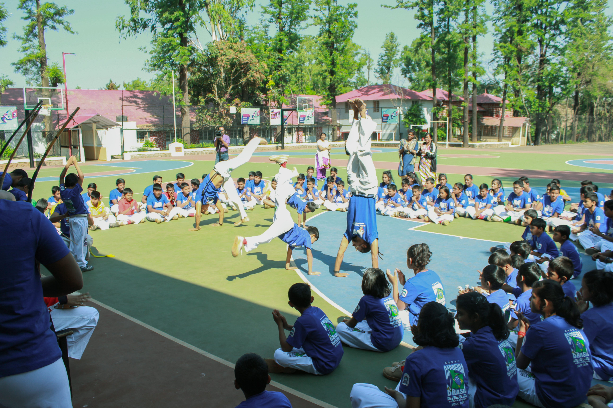
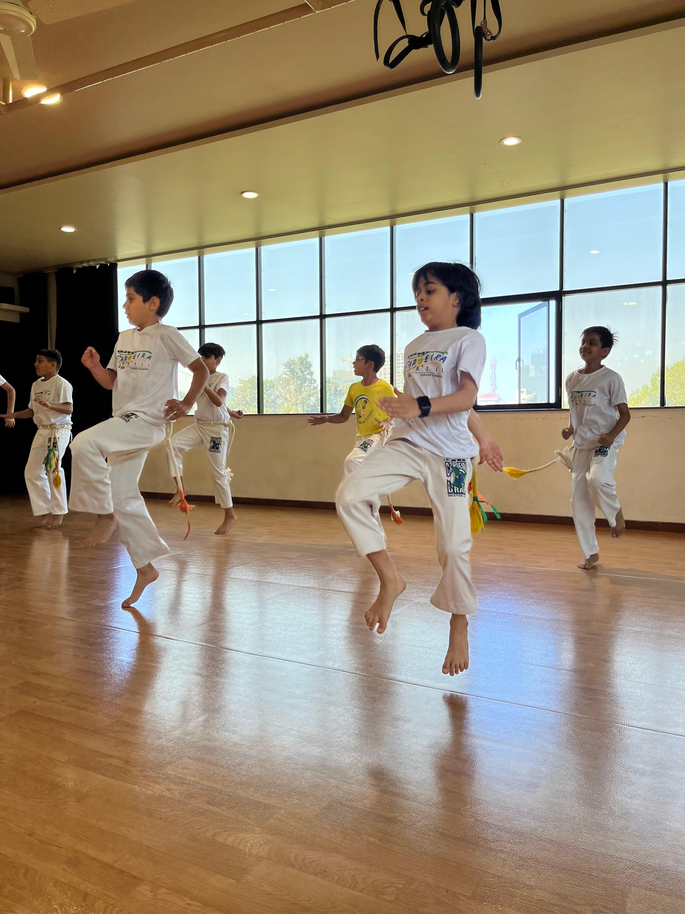
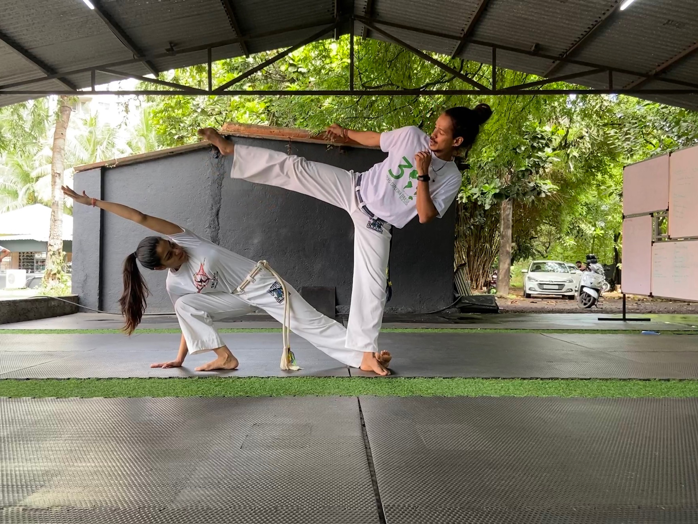
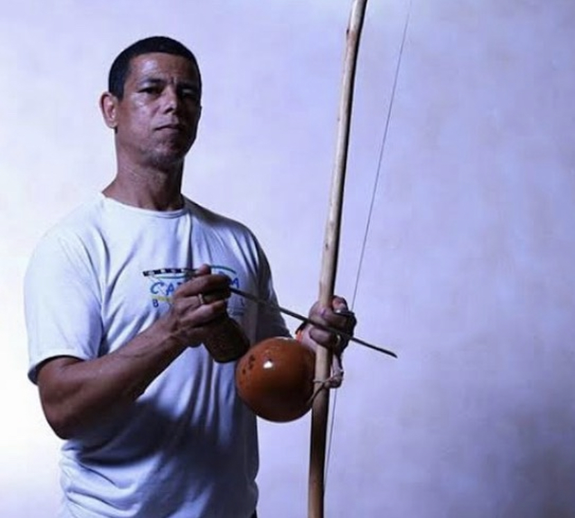

<!DOCTYPE html>
<html lang="en">
<head>
  <meta charset="UTF-8">
  <meta name="viewport" content="width=device-width, initial-scale=1">
  <title>Grupo Capoeira Brasil Pune</title>
  <link rel="stylesheet" href="style.css">
</head>
<body>
  <nav>
    

      
      Grupo Capoeira Brasil Pune
    

    <ul>
      <li><a href="#home">Home</a></li>
      <li><a href="#about-capoeira">About Capoeira</a></li>
      <li><a href="#instructor">About Instructor</a></li>
      <li><a href="#classes">Classes</a></li>
      <li><a href="#faq">FAQ</a></li>
      <li><a href="#gallery">Gallery</a></li>
      <li><a href="#contact">Contact</a></li>
    </ul>
  </nav>
  <main>
    <section id="home" class="section">
      <h1>Welcome to Grupo Capoeira Brasil Pune!</h1>
      <blockquote>
        Capoeira is more than just a martial art — it’s rhythm, movement, culture, and community all woven together. 
        It’s where music meets motion, where discipline meets fun, and where everyone, no matter their age, finds a place to grow.
      </blockquote>
      
At our academy, we train to move better, feel stronger, and connect deeper — with ourselves and with others. Whether you’re looking to improve your fitness, learn something new, or just experience the energy of Capoeira, you’re welcome here.

      
Grupo Capoeira Brasil Pune is part of Grupo Capoeira Brasil, one of the largest and most respected Capoeira organizations in the world. Founded in Brazil in 1989, our group is known for its strong roots, musicality, and open-hearted community — now spreading its rhythm across Pune and all of India.

      
<strong>Come be part of it.</strong> Step into the roda, feel the beat, and discover what Capoeira can bring to your life.

    </section>

    <section id="about-capoeira" class="section">
      <h2>🌀 What is Capoeira?</h2>
      
Capoeira is an Afro-Brazilian martial art that beautifully blends dance, music, acrobatics, and self-defense into one powerful and expressive art form. It is often described as a game rather than a fight — played between two people inside a circle called a roda, accompanied by traditional instruments like the berimbau, atabaque, and pandeiro.

      
Unlike most martial arts that rely on force, Capoeira focuses on rhythm, flow, and creativity. Every movement is a dialogue — a combination of attack, defense, and playfulness, all performed in harmony with the music. It trains not only the body but also the mind, encouraging agility, awareness, discipline, and community spirit.

      <h3>🪘 A Brief History of Capoeira</h3>
      
Capoeira was born in Brazil during the 16th century, created by African slaves who were brought to the country by Portuguese colonizers. These enslaved people combined African combat techniques, dances, and rhythms to develop a disguised form of self-defense — one that looked like a dance to deceive their masters.

      
For many years, Capoeira was banned in Brazil and practiced secretly, as it symbolized resistance and freedom. But over time, it evolved from a tool of survival to a cultural treasure. In the 20th century, great mestres (masters) like Mestre Bimba and Mestre Pastinha helped formalize and preserve Capoeira’s traditions, eventually leading to its recognition by UNESCO as an Intangible Cultural Heritage of Humanity in 2014.

      
Today, Capoeira is practiced worldwide, representing strength, freedom, art, and unity.

      <h3>🇮🇳 Capoeira in Pune</h3>
      
Capoeira made its way to Pune in the early 2010s, introduced through workshops and the growing influence of Grupo Capoeira Brasil (GCB) — one of the world’s most respected Capoeira organizations.

      
Under the guidance of Mestre Caxias and led locally by Instrutor Arrepiado, Capoeira has steadily grown into a vibrant community of students, artists, and athletes. Grupo Capoeira Brasil Pune now trains students of all ages — from toddlers to adults — nurturing not just skill, but also values of respect, rhythm, discipline, and joy.

      
Through regular classes, workshops, and annual events like the Batizado (graduation ceremony), Capoeira continues to spread its message of culture, movement, and unity across the city.

    </section>

    <section id="instructor" class="section">
      <h2>About Instrutor Arrepiado</h2>
      

        
        

          
<strong>Instrutor Arrepiado</strong>, known outside the roda as Sagar Jain, has been practicing Capoeira for over 14 years and teaching for more than 12 years. He represents Grupo Capoeira Brasil, one of the world’s most respected Capoeira organizations, under the guidance of Mestre Caxias.

          
His journey began with a deep fascination for the rhythm, movement, and energy of Capoeira — an art that combines martial arts, dance, music, and culture into one dynamic expression. Over the years, he has trained with masters and teachers from around the world, continuing to deepen his understanding of both the physical and cultural essence of the art.

          
In Pune, Instrutor Arrepiado founded Grupo Capoeira Brasil Pune, a growing community where students of all ages — from toddlers to adults — come together to explore Capoeira through movement, music, and connection. His teaching focuses on discipline, consistency, and joy, ensuring that every student learns not only the movements but also the spirit and tradition of Capoeira.

          
Instrutor Arrepiado’s mission is to make Capoeira accessible to everyone and to share its values of respect, resilience, and community across India.

        

      

    </section>

    <section id="classes" class="section">
      <h2>🥋 Classes</h2>
      
At Grupo Capoeira Brasil Pune, we offer Capoeira classes for all ages and experience levels — from playful beginners to dedicated practitioners.

      

        

          <h4>Little Capoeiristas (Ages 3.5–6)</h4>
          
Introducing rhythm, coordination, and teamwork through fun Capoeira-based games.

        

        

          <h4>Kids (Ages 7–12)</h4>
          
Developing strong fundamentals in movement, balance, and music while learning discipline and respect.

        

        

          <h4>Teens & Adults</h4>
          
Building technique, flow, acrobatics, and musicality — combining physical training with cultural understanding.

        

      

      

        <ul>
          <li>Teach in Schools and Colleges: Introducing Capoeira as a part of physical education, cultural events, and wellness programs.</li>
          <li>Offer Private Lessons: One-on-one sessions tailored to individual goals — from fitness and coordination to movement refinement.</li>
          <li>Conduct Small Curated Group Sessions: Perfect for families, friends, or corporate teams who want a personalized learning experience.</li>
        </ul>
      

      
Each class includes warm-ups, sequences, partner work, and music practice.

      
We also host workshops, performances, and our annual Batizado — a celebration of progress, tradition, and community.

      
📍 Classes held in Pune

      
📧 <a href="mailto:arrepiado@capoeirapune.com">arrepiado@capoeirapune.com</a>

    </section>

    <section id="faq" class="section">
      <h2>❓ FAQ</h2>
      <dl>
        <dt>Do I need any martial arts or dance experience to start?</dt>
        <dd>Not at all! Capoeira is for everyone. Beginners are always welcome.</dd>
        <dt>What should I wear for class?</dt>
        <dd>Comfortable workout clothes. Once you join regularly, you can get the official Grupo Capoeira Brasil Pune uniform.</dd>
        <dt>Is Capoeira suitable for kids?</dt>
        <dd>Yes — it’s one of the best arts for children to improve coordination, focus, and confidence, all while having fun.</dd>
        <dt>How often should I train?</dt>
        <dd>Ideally 2–3 times a week for steady progress, but even once a week with consistency can make a big difference.</dd>
        <dt>Is there music in Capoeira classes?</dt>
        <dd>Yes! Music is at the heart of Capoeira. Students learn to sing in Portuguese and play traditional instruments like the berimbau, atabaque, and pandeiro.</dd>
      </dl>
    </section>

    <section id="gallery" class="section">
      <h2>Gallery</h2>
      

        
        
        
        
        
      

    </section>

    <section id="contact" class="section">
      <h2>📞 Contact</h2>
      

        
<strong>Grupo Capoeira Brasil Pune</strong>

        
📍 Pune, India

        
📧 Email: <a href="mailto:arrepiad@capoeirapune.com">arrepiad@capoeirapune.com</a>

        
📞 Phone: <a href="tel:+919766481796">9766 481 796</a>

        
📸 Instagram: <a href="https://instagram.com/capoeirapune.india" target="_blank">@capoeirapune.india</a>

        
For class timings, trial sessions, or collaborations — message us on Instagram or email us directly.

      

    </section>
  </main>
  <footer>
    
&copy; 2025 Grupo Capoeira Brasil Pune | Designed for the Capoeira community

  </footer>
</body>
</html>
